# YouTube-like System Design on AWS

## Requirements

### Functional Requirements
- **Stream videos**  
- **Upload videos**  
- **Search videos** (by titles)  
- **Like/dislike videos**  
- **Add comments**  
- **View thumbnails**  

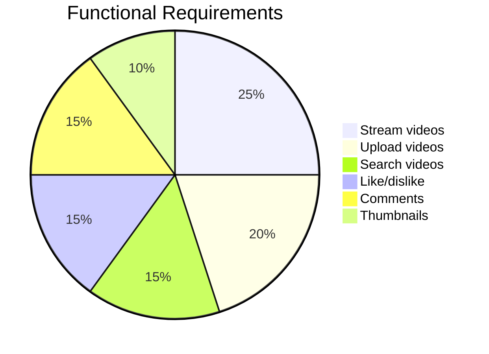

### Non-Functional Requirements
- **High Availability**: 99%+ uptime.  
- **Scalability**: Handle growth in storage, bandwidth, and concurrent requests.  
- **Performance**: Smooth streaming experience.  
- **Reliability**: No data loss (eventual consistency acceptable).  

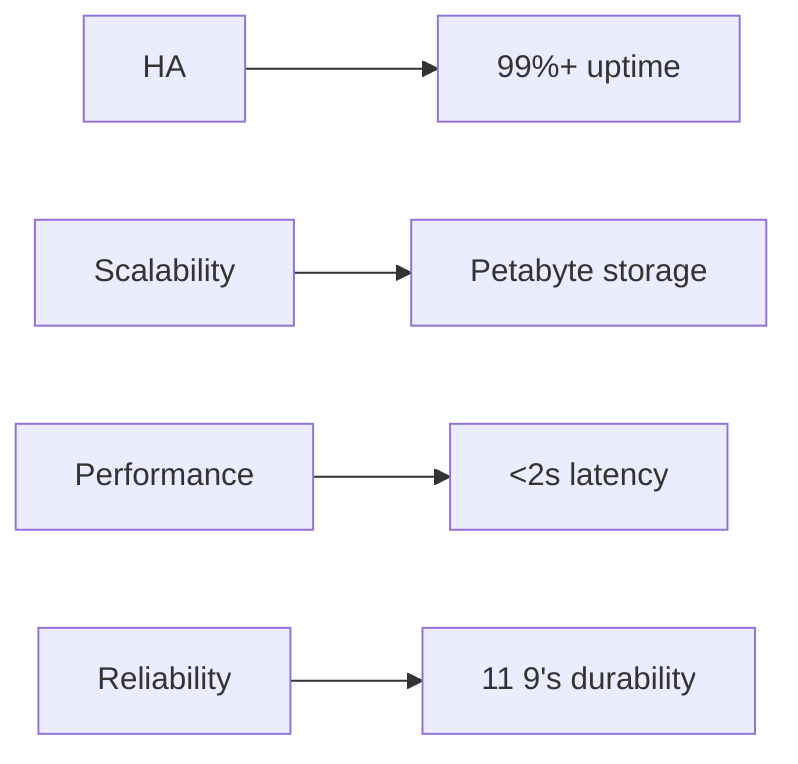

---

## Resource Estimation

### Assumptions
- **Total users**: 1.5 billion  
- **Daily active users (DAU)**: 500 million  
- **Avg video length**: 5 minutes  
- **Video size (pre-encoding)**: 600 MB → **Post-encoding**: 30 MB  

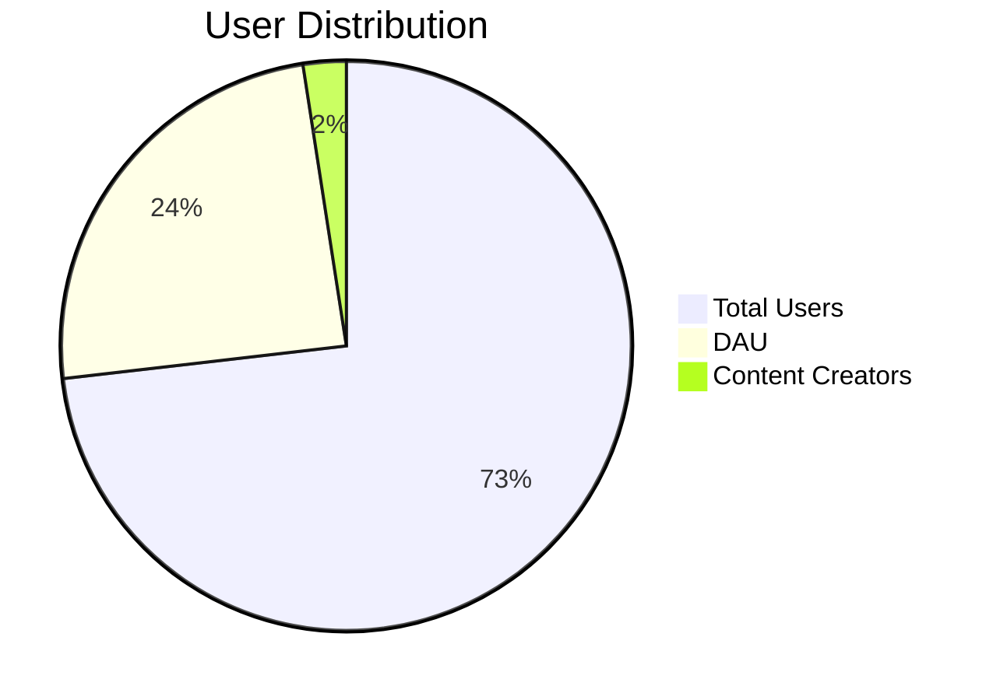

### Storage
- **Content uploaded/minute**: 500 hours = 30,000 minutes  
- **Storage/minute**: 6 MB (for 1 video format) → **5 formats**: 30 MB/min  
- **Total storage/minute**:  
  `500 hrs × 60 min/hr × 30 MB/min = 900 GB/min`  

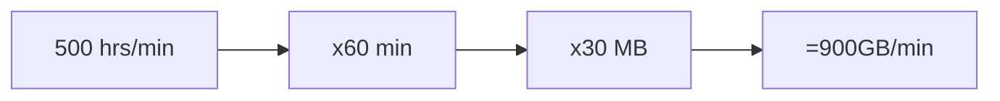

### Bandwidth
- **Upload-to-view ratio**: 1:300  
- **Upload bandwidth**:  
  `500 hrs × 60 min/hr × 120 MB/min × 8 bits/Byte ÷ 60 sec = 480 Gbps`  

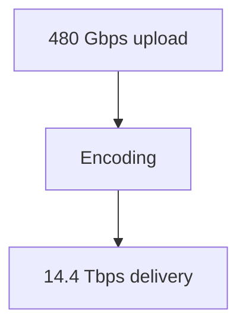

### Servers
- **Concurrent requests**: 500M DAU  
-  **Requests/server**: Youtube server handles 8,000/sec → **Servers needed**: `500M / 8k = 62,500`  

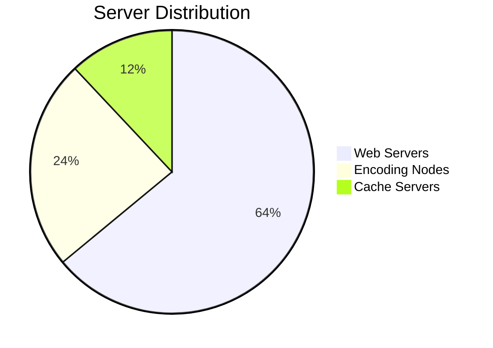

---

## AWS Components Mapping

| Component          | AWS Service                     | Notes                                  |
|--------------------|---------------------------------|----------------------------------------|
| **CDN**            | Amazon CloudFront               |Low-latency video delivery.            |
| **Web Servers**    | EC2 (Auto Scaling Groups)       | Host application logic.                |
| **Upload Storage** | S3                              |Store raw/encoded videos.              |
| **Video Metadata** | DynamoDB                        |Titles, likes, comments (NoSQL).       |
| **User Data**      | Cognito + DynamoDB              |Authentication + user profiles.        |
| **Load Balancer**  | ALB/ELB                         |Distribute traffic to EC2 instances.   |
| **Encoders**       | AWS Elemental MediaConvert      |Transcode videos to multiple formats.  |
| **Streaming**      | Amazon IVS or Kinesis Video     |Real-time video streaming.             |
| **Thumbnails**     | S3 + CloudFront                 |Fast delivery of thumbnails.           |
| **Comments**       | DynamoDB/ElastiCache (Redis)    |Low-latency read/write.                |

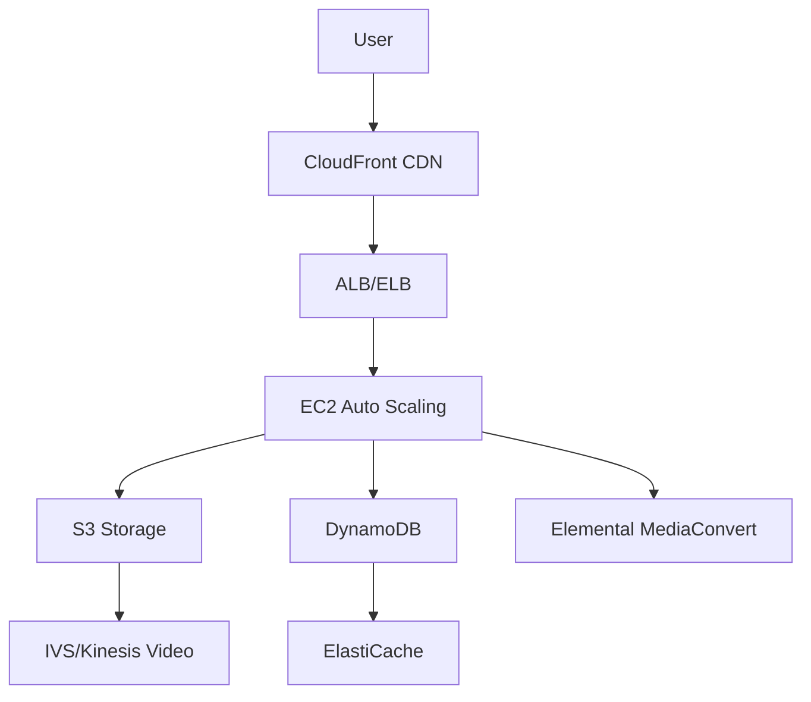

---

## Key Design Choices
1. **Eventual Consistency**: Notifications for new videos may delay (non-critical).  
2. **Scalability**:  
   - **Horizontal Scaling**: EC2 Auto Scaling + DynamoDB sharding.  
   - **Storage**: S3 (unlimited scalability).  
3. **Performance**:  
   - **Caching**: CloudFront + ElastiCache for metadata/comments.  
   - **Parallel Processing**: Lambda for encoding/transcoding jobs.  

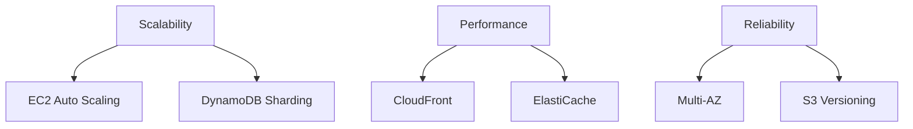

## Data Flow

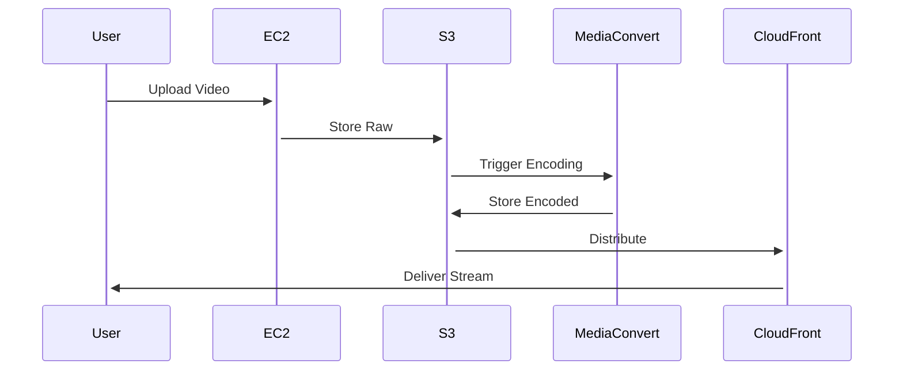

---

## Formulas
- **Storage/min**:  
  `Total Upload (min) × Storage per min (MB)`  
- **Bandwidth (Gbps)**:  
  `(Hours/min × 60 × MB/min × 8) ÷ 60`  
- **Servers**:  
  `Active users / Queries per server`  

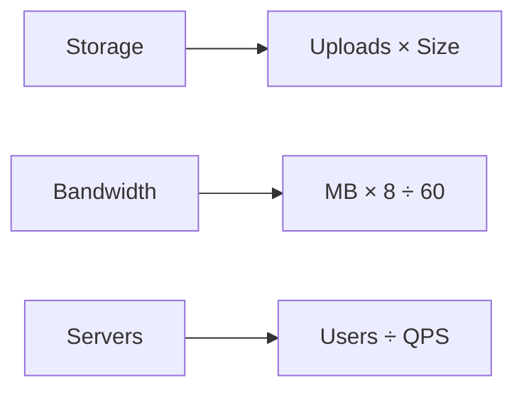

## Failure Handling

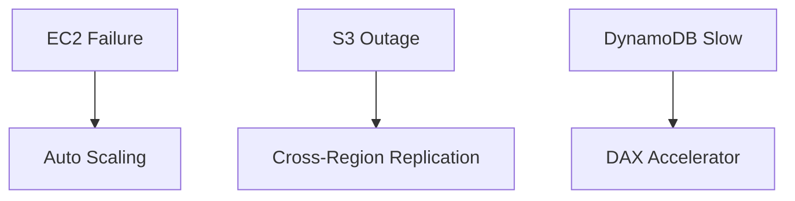
