# YouTube-like System Design: Evaluation (AWS)

## Fulfilling Requirements

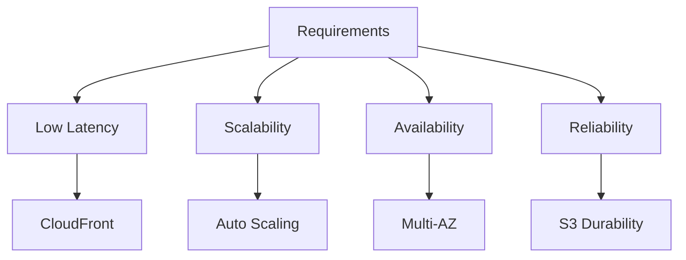

| Requirement          | AWS Strategy                                                                 | Techniques                                                                 |
|----------------------|------------------------------------------------------------------------------|----------------------------------------------------------------------------|
| **Low Latency**      | CloudFront (Global CDN) + Local Zones                                        | - Edge caching for popular content. - S3 + CloudFront for thumbnails.   |
| **Scalability**      | Auto Scaling (EC2), DynamoDB, S3                                             | - Horizontal scaling of web/app servers. - DynamoDB auto-partitioning.  |
| **Availability**     | Multi-AZ Deployments + Global Tables (DynamoDB)                              | - Data replication across AZs. - ELB health checks for dead servers.    |
| **Reliability**      | S3 (11 nines durability) + Backup (AWS Backup)                               | - Data partitioning (user vs. video metadata). - Heartbeat monitoring.  |

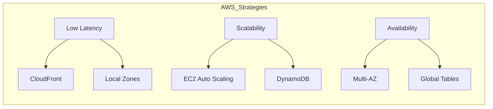

---

## Trade-offs & AWS Solutions

### 1. **Consistency**
   - **Choice**: Eventual consistency (over strong consistency).  
   - **Why**: High availability prioritized (CAP theorem).  
   - **AWS Service**: DynamoDB (tunable consistency for user data).  

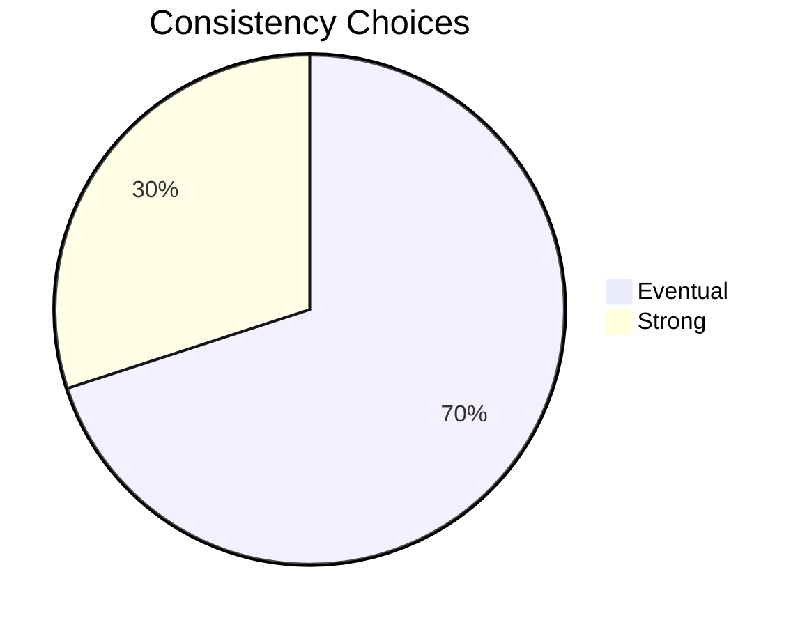

### 2. **Distributed Cache**
   - **Choice**: Amazon ElastiCache (Redis/Memcached) over centralized cache.  
   - **Why**: Fault tolerance + LRU eviction for long-tailed access patterns.  

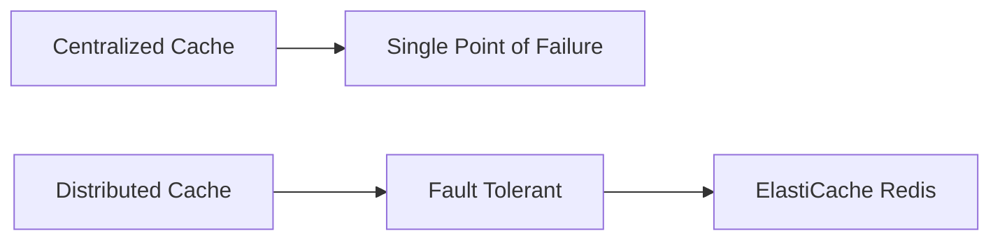

### 3. **Bigtable vs. MySQL**
   | Aspect           | AWS Bigtable Alternative (DynamoDB)       | AWS MySQL Alternative (Aurora)          |
   |------------------|------------------------------------------|-----------------------------------------|
   | **Use Case**     | Thumbnails, video metadata (high scale)  | User data (structured, ACID-compliant). |
   | **Scalability**  | Auto-partitioning (NoSQL).               | Read replicas (limited writes).         |

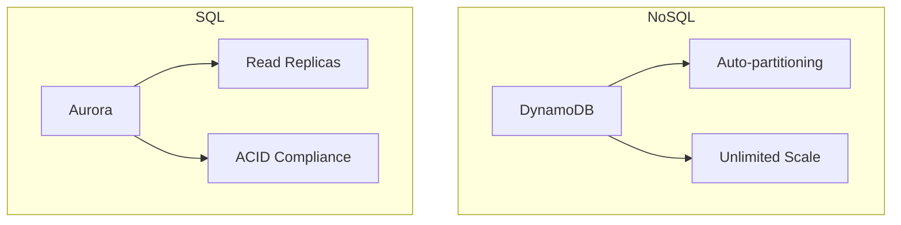

### 4. **Public vs. Private CDN**
   - **Public CDN**: CloudFront (cost-effective for low-traffic regions).  
   - **Private CDN**: CloudFront + Local Zones (high-traffic optimization).  

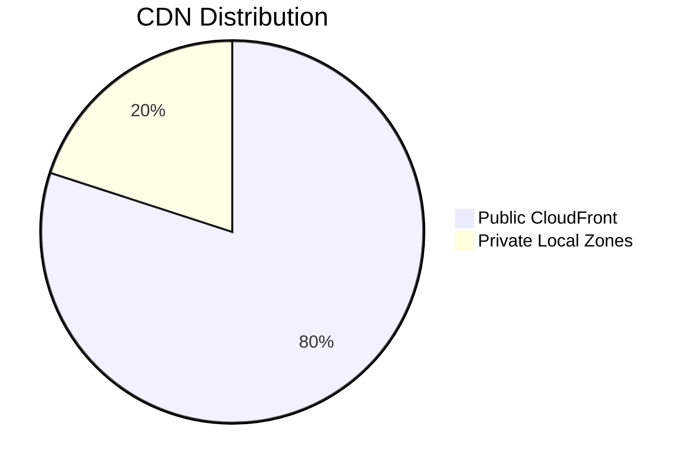

### 5. **Duplicate Videos**
   - **Problem**: 9.5 PB/year wasted (50 duplicate hours/minute).  
   - **AWS Solution**:  
     - **AI/ML**: Amazon Rekognition (content matching).  
     - **Storage**: S3 Lifecycle Policies to archive duplicates.  

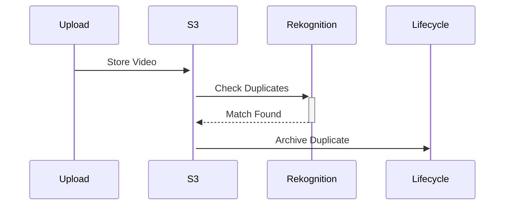

---

## Future Scaling with AWS

### Challenges & Solutions
| Scaling Need          | AWS Service/Strategy                        | Benefit                                      |
|-----------------------|--------------------------------------------|----------------------------------------------|
| **Web Servers**       | EC2 Auto Scaling + ALB                      | Handle traffic spikes.                       |
| **Datastores**        | DynamoDB (NoSQL) + Aurora (SQL)             | Avoid MySQL choke points.                    |
| **Disaster Recovery** | AWS Backup + Cross-Region Replication       | RTO/RPO compliance.                          |
| **Vitess Alternative**| Amazon Aurora Global Database               | MySQL-compatible + NoSQL-like scaling.       |

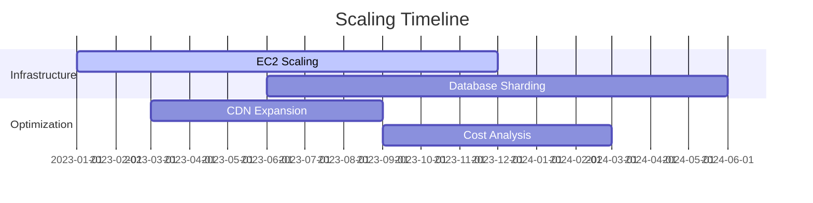

### Custom Web Server
- **AWS Option**: Custom EC2 AMI (optimized for video serving).  
- **Why**: General-purpose servers (e.g., Lighttpd) may not suffice at scale.  

## Cost Optimization Framework
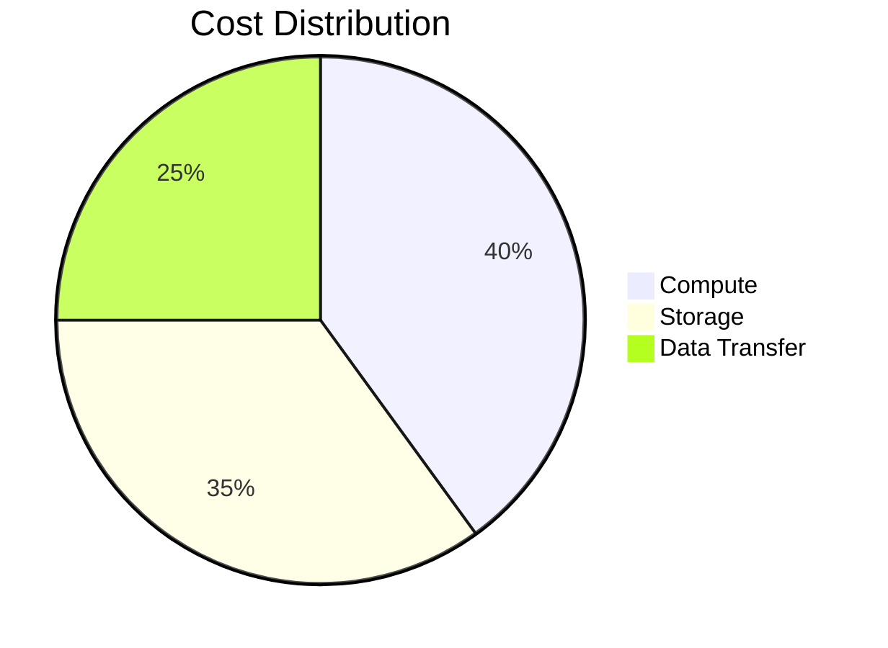

---

# YouTube-like System Design: Evaluation (AWS)

## Fulfilling Requirements

| Requirement          | AWS Strategy                                                                 |
|----------------------|------------------------------------------------------------------------------|
| **Low Latency**      | CloudFront (Global CDN) + Local Zones                                        |
| **Scalability**      | Auto Scaling (EC2), DynamoDB, S3                                             |
| **Availability**     | Multi-AZ Deployments + Global Tables (DynamoDB)                              |

---

### Scaling Solutions Matrix
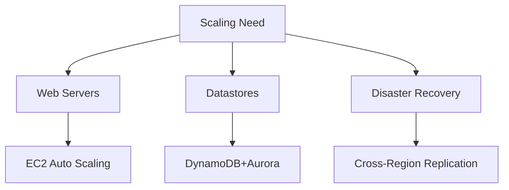

---

## Failure Handling Architecture
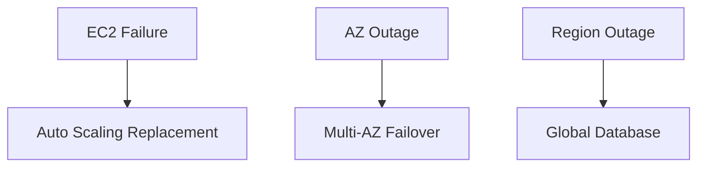

## Key Takeaways

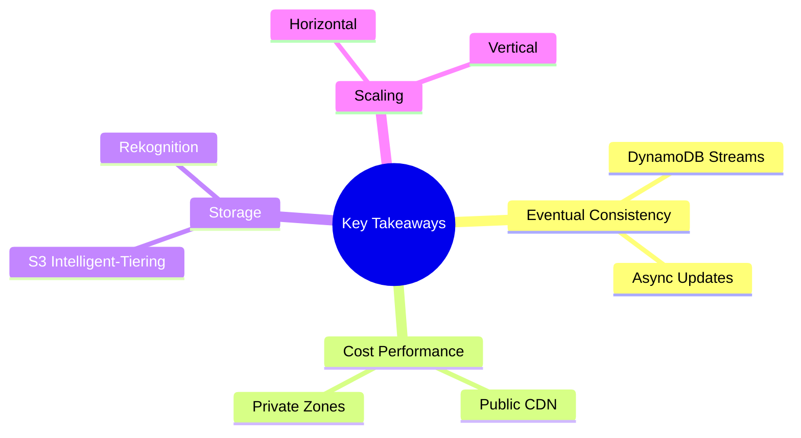

1. **Eventual Consistency**: Acceptable for video metadata (DynamoDB Streams for async updates).  
2. **Cost vs. Performance**:  
   - Public CDN (CloudFront) for most regions.  
   - Private CDN (Local Zones) for high-density areas.  
3. **Storage Optimization**:  
   - S3 Intelligent-Tiering for videos.  
   - Rekognition to detect duplicates.  
4. **Scalability**:  
   - **Horizontal**: EC2 + DynamoDB.  
   - **Vertical**: Aurora (SQL) + ElastiCache (Redis).  

